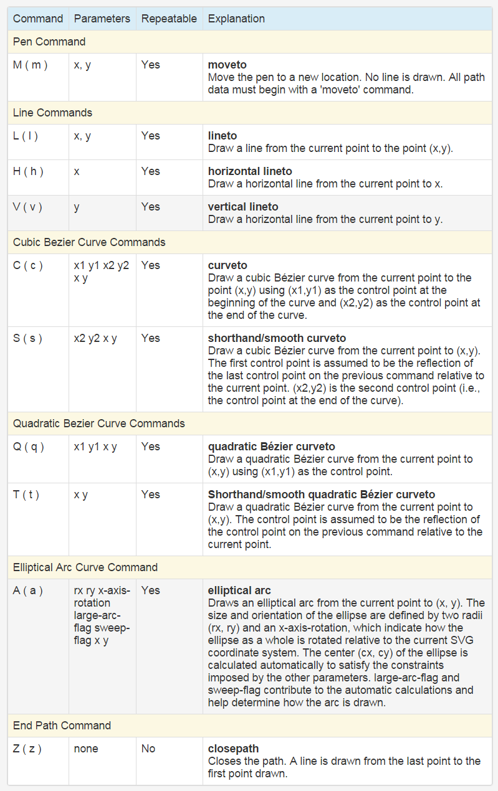

## D3.js

## Dashing D3.js

[Table of contents](https://www.dashingd3js.com/table-of-contents)

### The Data Visualization Process

- Acquire
  - Obtain the data, whether from a file on a disk or a source over a network.
- Parse
  - Provide some structure for the data's meaning, and order it into categories.
- Filter
  - Remove all but the data of interest.
- Mine
  - Apply methods from statistics or data mining as a way to discern patterns or place the data in mathematical context.
- Represent
  - Choose a basic visual model, such as a bar graph, list, or tree.
- Refine
  - Improve the basic representation to make it clearer and more visually engaging.
- Interact
  - Add methods for manipulating the data or controlling what features are visible.

### Basics

__SVG__

SVG comes with a basic set of shape elements:

- Rectangle
- Circle
- Ellipse
- Straight Line
- Polyline
- Polygon

__SVG Paths__

The instructions of the path are defined in case-senstive terms:

- moveto: set a new current point
- lineto: draw a straight line
- curveto: draw a curve using a cubic Bézier
- arc: elliptical or circular arc
- closepath: close the current shape by drawing a line to the last moveto

> If the letters in the path are capitalized which means that we are using absolute positioning within our SVG Viewing window. If we use lower case commands, then we will be using relative positioning.

__SVG Group transformations__

### D3 SVG Paths

__Line interpolations__

- linear
  - piecewise linear segments, as in a polyline.
- step-before
  - alternate between vertical and horizontal segments, as in a step function.
- step-after
  - alternate between horizontal and vertical segments, as in a step function.
- basis
  - a B-spline, with control point duplication on the ends.
- basis-open
  - an open B-spline; may not intersect the start or end.
- basis-closed
  - a closed B-spline, as in a loop.
- bundle
  - equivalent to basis, except the tension parameter is used to straighten the spline.
- cardinal
  - a Cardinal spline, with control point duplication on the ends.
- cardinal-open
  - an open Cardinal spline; may not intersect the start or end, but will intersect other control points.
- cardinal-closed
  - a closed Cardinal spline, as in a loop.
- monotone
  - cubic interpolation that preserves monotonicity in y.

[More](https://www.dashingd3js.com/svg-paths-and-d3js)

__D3 Path generators__

The generators include:

- d3.svg.line() - create a new line generator
- d3.svg.line.radial() - create a new radial line generator
- d3.svg.area() - create a new area generator
- d3.svg.area.radial() - create a new radial area generator
- d3.svg.arc() - create a new arc generator
- d3.svg.symbol() - create a new symbol generator
- d3.svg.chord() - create a new chord generator
- d3.svg.diagonal() - create a new diagonal generator
- d3.svg.diagonal.radial() - create a new radial diagonal generator

### D3 Virtual Selections

> The D3.js Data Operator returns three virtual selections rather than just the regular one like other methods.

The three virtual selections are enter, update and exit.

- The enter selection contains placeholders for any missing elements.
- The update selection contains existing elements, bound to data.
- Any remaining elements end up in the exit selection for removal.

### D3 Scales

- Identity: a special kind of linear scale, 1:1, good for pixel values. input == output
- Linear: transforms one value in the domain interval into a value in the range interval
- Power and Logarithmic scales: sqrt, pow, log – used for exponentially increasing values
- Quantize and Quantile scales: for discrete sets of unique possible values for inputs or outputs
- Ordinal: for non quantitative scales, like names, categories, etc.

## Others

- [http://gcoch.github.io/D3-tutorial/](http://gcoch.github.io/D3-tutorial/)
- [https://square.github.io/intro-to-d3/](https://square.github.io/intro-to-d3/)
